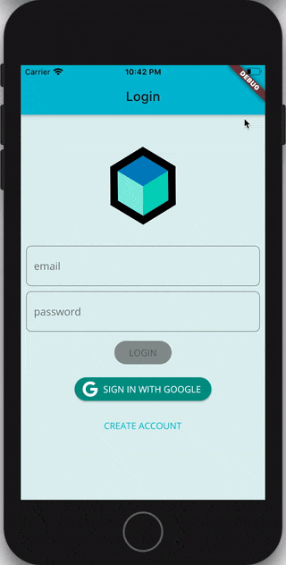

# Flutter Firebase Login Tutorial


> In the following tutorial, we're going to build a Firebase Login Flow in Flutter using the Bloc library.



## Setup

We'll start off by creating a brand new Flutter project

```sh
flutter create flutter_firebase_login
```

We can then replace the contents of `pubspec.yaml` with

[pubspec.yaml](https://raw.githubusercontent.com/felangel/bloc/master/examples/flutter_firebase_login/pubspec.yaml ':include')

Notice that we are specifying an assets directory for all of our applications local assets. Create an `assets` directory in the root of your project and add the [bloc logo](https://github.com/felangel/bloc/blob/master/examples/flutter_firebase_login/assets/bloc_logo_small.png) asset (which we'll use later).

then install all of the dependencies

```sh
flutter packages get
```

The last thing we need to do is follow the [firebase_auth usage instructions](https://pub.dev/packages/firebase_auth#usage) in order to hook up our application to firebase and enable [google_signin](https://pub.dev/packages/google_sign_in).
